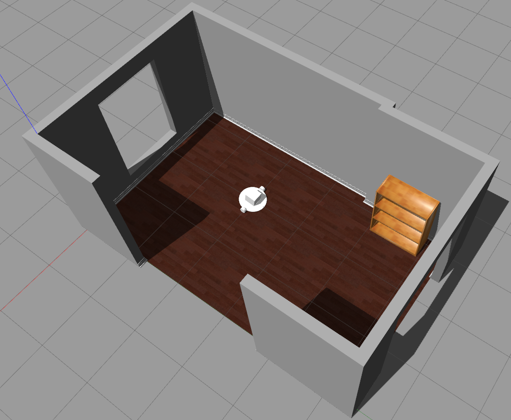

# Living Room Cleanup Simulation Project 

 

This repository contains a ROS package for a project that is being created to consolidate learning and practice applying machine learning, computer vision, and robotics concepts. The goal of this project is to create a simulation that mirrors a real life environment (such as the authors living room) and to run a simulated robot in the environment to demonstrate a number of machine learning and computer vision tasks. 

The project under development will consist of a simulated environment that includes the following: 

* Either a replica of the authors own living room or a close likeness using custom modeled SDF files

* A pre-made model of any popular mobile manipulator robot that has an adequate number of sensors.  

* Some furniture and other assets that will be placed in the living room environment 

* Some smaller movable objects (such as children's toys) that the robot will need to manipulate in order to tidy up the room 

The main objective of this simulation will be to demonstrate robot control by using computer vision, sensor data and machine learning to perform a common household task of tidying up a living room.      
 

## Installation: 

 

Currently this package is being developed under ROS Melodic Version: 1.14.6 and Gazebo version 9.0 

 

To run the simulation, this package can be cloned directly into the user's catkin workspace src directory. In order to load the SDF assets, the following environment variable must be added to the user's .bashrc file: 

 

`export GAZEBO_MODEL_PATH=~/catkin_ws/src/living_room_sim_1/models:${GAZEBO_MODEL_PATH}` 

 

## Usage: 

To launch an empty living room environment:

`roslaunch living_room_sim_1 living_room.launch`               

To launch the living room environment with a simple hobo robot:

`roslaunch living_room_sim_1 living_room_hobo.launch`

(Note, you must have the hobo package installed in parallel with this ROS package)

To launch the living room environment with a locobot robot:

`roslaunch living_room_sim_1 living_room_locobot.launch`

(Note, you must have the locobot package installed in parallel with this ROS package)